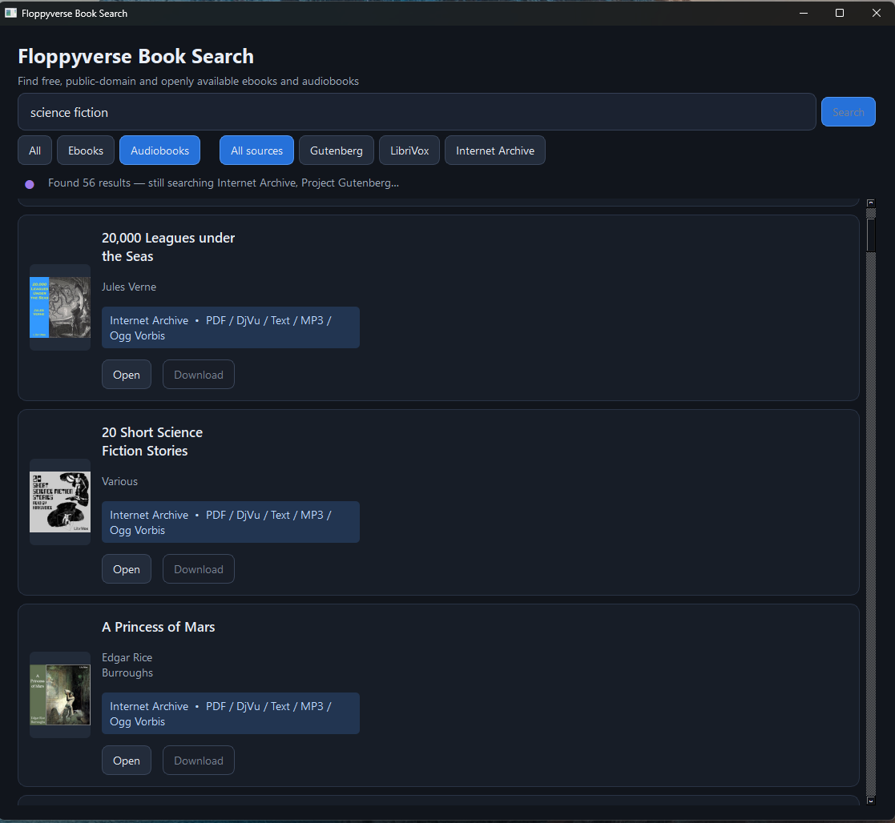

# 📚 Floppyverse Book Search

Search free, public-domain, and openly available books from one friendly Windows app.

Floppyverse searches multiple catalogs at the same time and presents ebooks and audiobooks in a clean, dark interface.

**Current version: `v1.1.0`**



## ✨ Features

- 🔎 Search by title, author, or subject
- 📖 Find ebooks from Project Gutenberg and Internet Archive
- 🎧 Find audiobooks from LibriVox and Internet Archive
- ⚡ Search all sources concurrently without freezing the interface
- 🖼️ View cover artwork and useful book details
- 🧰 Filter by ebook, audiobook, or source
- 🔗 Open catalog pages and legal direct downloads when available
- 🧹 Merge duplicate editions where practical
- 🛟 Continue showing partial results if one catalog is unavailable
- 🌙 Comfortable dark Windows interface

## 🚀 Quick start on Windows

### What you need

- Windows 10 or Windows 11
- [Python 3.10 or newer](https://www.python.org/downloads/windows/)
- An internet connection

When installing Python, select **Add Python to PATH**.

### Start the app

1. Download and extract the project.
2. Open the **Floppyverse Book Search** folder.
3. Double-click **`Floppyverse Book Search.vbs`**—the only visible launcher at the top level.
4. Wait a moment on the first launch while dependencies are installed.

Only the app interface appears. Setup and Python run invisibly in the background.

> 🛠️ If startup fails, check `app/floppyverse-launch.log`. You can also run `app/RUN.bat` to see detailed setup messages.

## 🔍 Good searches to try

- `The Time Machine`
- `H. G. Wells`
- `Frankenstein`
- `science fiction`
- `Jane Austen`

## 🌐 Search sources

| Source | Content | Notes |
|---|---|---|
| 📗 Project Gutenberg | Ebooks | Queried through the open Gutendex catalog API |
| 🎙️ LibriVox | Audiobooks | Public-domain volunteer recordings |
| 🏛️ Internet Archive | Ebooks and audio | Availability and usage rights are shown on each item page |

Standard Ebooks is reserved for a future optional integration because complete anonymous OPDS access is not currently straightforward.

## 🧑‍💻 Developer setup

```powershell
cd app
py -3 -m venv .venv
.venv\Scripts\python -m pip install -r requirements.txt
.venv\Scripts\python -m floppyverse
```

Run the tests with:

```powershell
.venv\Scripts\python -m unittest discover -s tests -v
```

## 🏷️ Versioning

The authoritative version is stored in `app/floppyverse/__init__.py` and appears in the app window and title bar.

Every published application change must increment the version:

- **Patch** (`1.1.0` → `1.1.1`) for fixes and small refinements
- **Minor** (`1.1.0` → `1.2.0`) for new features
- **Major** (`1.x` → `2.0`) for incompatible or substantial redesigns

Git tags and GitHub releases use the same version prefixed with `v`.

## 🗂️ Project layout

```text
Floppyverse Book Search.vbs
                         The only top-level launcher
app/                     Supporting application files
  floppyverse/           Application code and catalog integrations
  tests/                 Automated checks
  RUN.bat                Visible troubleshooting launcher
  launch.cmd             Internal hidden-launch helper
  requirements.txt       Python dependencies
```

## ⚖️ Content and downloads

Floppyverse is a catalog search client. It searches sources intended for public-domain or openly available material. Rights and availability can vary by item and location, especially on Internet Archive. Always follow the terms and rights information on the source item page.
